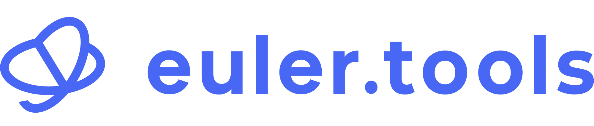
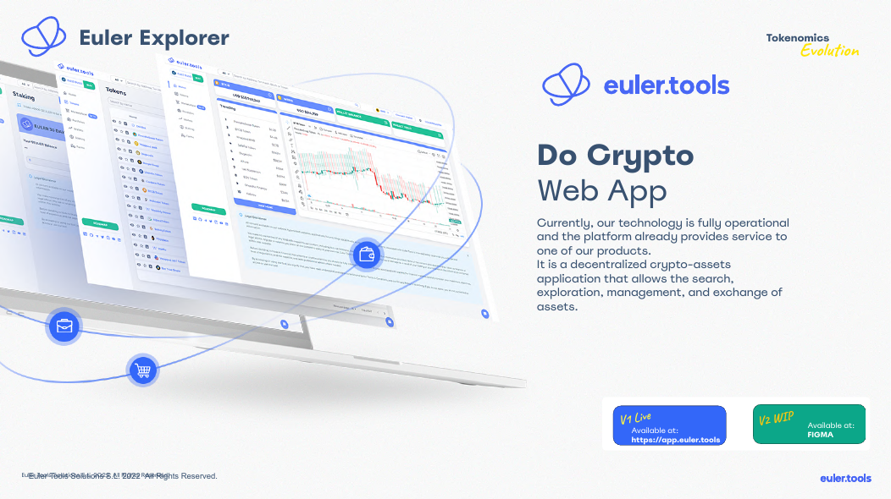
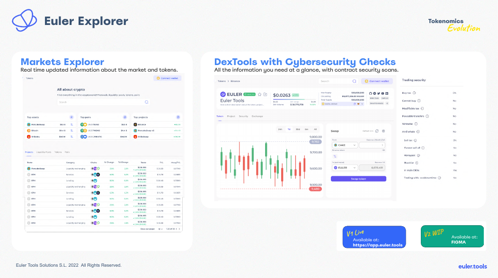
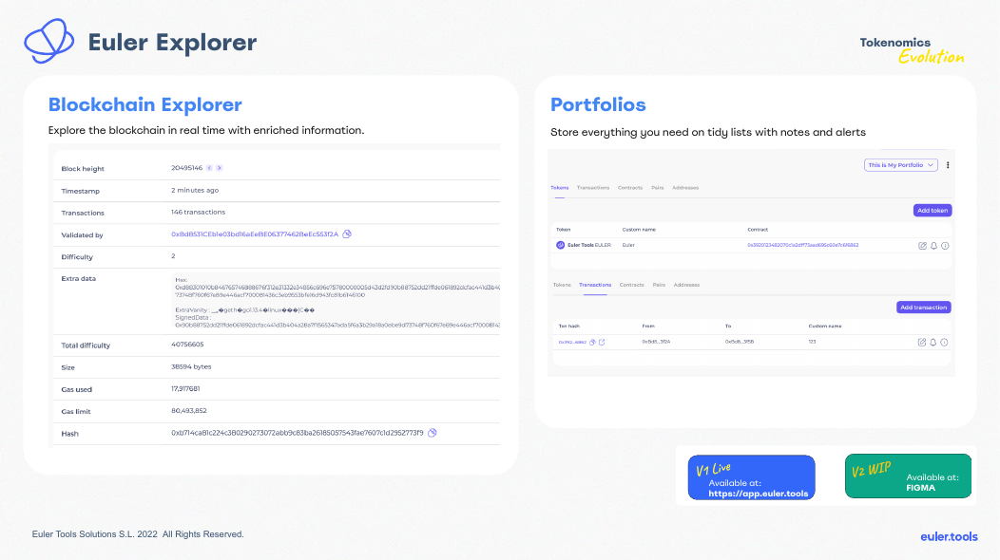
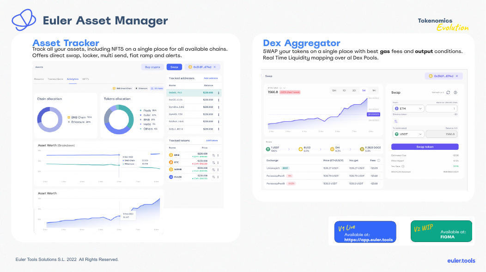
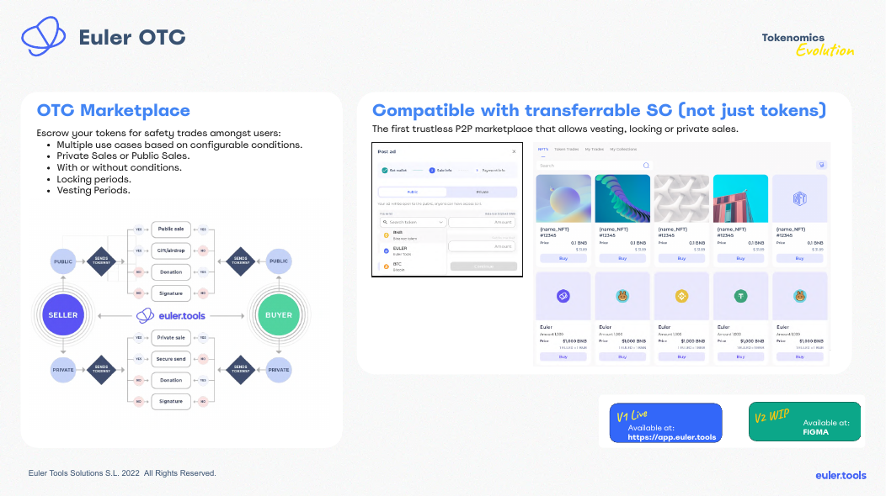
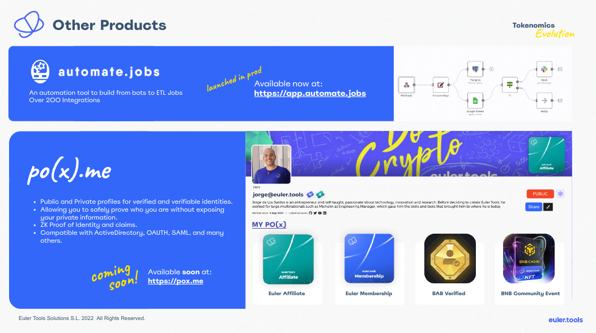

  

  

<h1 align="center">Euler Tools ha cerrado · Euler Tools is closed</h1>

  <em>Esta organización ya no opera. This organization no longer operates.</em>

  <a href="https://euler.tools">euler.tools</a>
  ·
  <a href="https://github.com/eulertools">github.com/eulertools</a>
  ·
  <a href="https://sinequix.com">sinequix.com</a>
  ·
  <a href="https://github.com/tebayoso">@tebayoso</a>

---

## Español

**Euler Tools desapareció.** La empresa quebró. No hay, ni habrá, mantenimiento, actualizaciones, soporte, garantía ni continuidad de servicio sobre nada publicado en esta organización.

El software que aún se muestra aquí se ofrece **tal cual (*as is*)**, sin garantías de ningún tipo — expresas o implícitas — incluyendo, sin limitación, comerciabilidad, idoneidad para un fin particular y no infracción. Quien lo use, clone o despliegue lo hace **bajo su propio riesgo**.

Parte de este material **puede ser reclamado por acreedores** u otros titulares en el marco de la liquidación. Nada en este perfil constituye cesión, licencia, promesa de indemnidad ni reconocimiento de derechos.

**No hay soporte.** No se responderán issues, pull requests ni correos dirigidos a Euler Tools.

Sitio: [euler.tools](https://euler.tools). Consultas: [sinequix.com](https://sinequix.com) · [@tebayoso](https://github.com/tebayoso).

Parte del código de producto se está publicando en esta organización como snapshots huérfanos (sin historial privado). El resto permanece archivado y privado.

---

## English

**Euler Tools is gone.** The company went bankrupt. There is no maintenance, no updates, no support, no warranty, and no service continuity — and there will be none — for anything published under this organization.

Software still visible here is provided **as is**, without warranties of any kind, express or implied, including but not limited to merchantability, fitness for a particular purpose, and non-infringement. Anyone who uses, clones, or deploys it does so **at their own risk**.

Some of this material **may be claimed by creditors** or other rightsholders as part of the winding-up. Nothing on this profile is an assignment, a license, an indemnity, or an acknowledgement of title.

**There is no support.** Issues, pull requests, and mail sent to Euler Tools will not be answered.

Site: [euler.tools](https://euler.tools). Enquiries: [sinequix.com](https://sinequix.com) · [@tebayoso](https://github.com/tebayoso).

Some product code is being published here as orphan snapshots (no private git history). The rest stays archived and private.

---

## Fundador · Founder

**[Jorge de los Santos](https://github.com/tebayoso)** (@tebayoso) — Founder, CEO & CTO · 2020–2023.

Fundó Euler Tools desde Tandil, Argentina, y la llevó en los años de Barcelona: explorer, marketplace, oráculos y el token $EULER. Cerró la empresa en 2023. Antes fundó [Sinequix](https://sinequix.com); sigue construyendo desde Tandil.

He founded Euler Tools from Tandil, Argentina, and ran it through the Barcelona years. He shut the company down in 2023. He founded Sinequix before Euler and still builds from Tandil.

- GitHub: [tebayoso](https://github.com/tebayoso)
- LinkedIn: [tebayoso](https://www.linkedin.com/in/tebayoso/)
- X: [@tebayoso](https://x.com/tebayoso)
- Site: [tebayoso.github.io](https://tebayoso.github.io/)
- pox.me: [tebayoso](https://pox.me/id/tebayoso)
- Sinequix: [sinequix.com](https://sinequix.com)
- Email: [jorge@pox.me](mailto:jorge@pox.me)

---

## Gracias · Special thanks

A quienes construyeron Euler Tools con Jorge. Nombres y roles tomados de la web pública de 2022, créditos de repositorios y CODEOWNERS. Perfiles públicos cuando existen.

People who built Euler Tools with Jorge. Names and roles from the 2022 public site, repo credits, and CODEOWNERS.

| Name | Role | Links |
|---|---|---|
| **Alejandro Silva** | VP of Engineering | [LinkedIn](https://www.linkedin.com/in/raventools-labs/) |
| **Doruk Tiryaki** | CMO | [LinkedIn](https://www.linkedin.com/in/doruktiryaki/) |
| **Nico Álvarez** | Graphic designer & brand | [LinkedIn](https://www.linkedin.com/in/esnicoalvarez/) |
| **Agustín Gabiola** | Frontend lead | [GitHub](https://github.com/agustintin) · [LinkedIn](https://www.linkedin.com/in/agust%C3%ADn-gabiola-548656a4/) |
| **Eric Menagatti** | Frontend | [LinkedIn](https://www.linkedin.com/in/ericmenagatti/) |
| **Estefanía Rodríguez** | UX/UI | [LinkedIn](https://www.linkedin.com/in/rod-estefania/) |
| **Victor Goff** | IT & security | [GitHub](https://github.com/kotp) · [LinkedIn](https://www.linkedin.com/in/vgoff/) |
| **Meliksah Gurtemel** | Smart contracts (p2p / staking) | [GitHub](https://github.com/meliksahgurtemel) |

**Gracias especiales.** Euler Tools no existiría sin este equipo. This project would not have existed without them.

Si falta alguien, es un olvido del archivo, no de la deuda. If someone is missing, that is an archival gap, not a lack of thanks.

---

## Código público · Public snapshots

Snapshots huérfanos (un commit, sin historial privado). Orphan snapshots (single commit, no private history). **As is.**

**Contracts**
- [contracts](https://github.com/eulertools/contracts)
- [p2p-contracts](https://github.com/eulertools/p2p-contracts)
- [blockchain-contracts](https://github.com/eulertools/blockchain-contracts)
- [blockchain-hardhat-contracts](https://github.com/eulertools/blockchain-hardhat-contracts)
- [euler-blockchain-contracts](https://github.com/eulertools/euler-blockchain-contracts)
- [blockchain-laboratory](https://github.com/eulertools/blockchain-laboratory)

**Apps / APIs**
- [euler-api](https://github.com/eulertools/euler-api)
- [euler-cli](https://github.com/eulertools/euler-cli)
- [typescript-sdk](https://github.com/eulertools/typescript-sdk)
- [explorer-v2](https://github.com/eulertools/explorer-v2)
- [subscriptions-client](https://github.com/eulertools/subscriptions-client)
- [euler-unstoppable-login](https://github.com/eulertools/euler-unstoppable-login)
- [docs.euler.tools](https://github.com/eulertools/docs.euler.tools)

**Collectors / infra snippets**
- [websocket-clients](https://github.com/eulertools/websocket-clients)
- [evm-socket-client](https://github.com/eulertools/evm-socket-client)
- [cdk-constructs](https://github.com/eulertools/cdk-constructs)
- [slack-notifications](https://github.com/eulertools/slack-notifications)
- [Discord-Bot](https://github.com/eulertools/Discord-Bot)
- [support](https://github.com/eulertools/support)

Landing: [euler.tools](https://euler.tools).

---

## Productos · Products

Material de 2022 (*Crypto Products — Tokenomics*). Todo **as is**. Enlaces históricos; no hay servicio vivo.

| Producto | Qué era | Estado en 2022 |
|---|---|---|
| **$EULER** | Token de inversión (V1 supply fijo → V2 elástico, 89M max). Buybacks con fees de contratos. Distribución: 81M users / 8M project. | Tokenomics V2 |
| **Membership (MEMBER)** | NFT DAO, descuentos, mint ligado al token. Max supply 20.000. Alquilable / tradable / rewards. | Diseñado |
| **Affiliate (AFF)** | NFT de utilidad, suscripción lifetime a productos. Max supply 2.000 (circulante / 40.000). | Diseñado |
| **Ecosystem Dashboard** | Transparencia: wallets doxxed, métricas, bridge, rewards, helper de migración V1→V2 | `app.euler.tools/token/euler` |
| **Euler Explorer** | Web app cripto: search, exploración, gestión e intercambio de activos | V1 live / V2 WIP Figma |
| **Markets + DexTools** | Mercados en tiempo real y DexTools con checks de ciberseguridad de contratos | V1 live |
| **Blockchain Explorer + Portfolios** | Explorer on-chain enriquecido y listas de portfolios con notas y alertas | V1 live |
| **Euler OTC** | Marketplace P2P trustless: escrow, ventas públicas/privadas, locking, vesting. Compatible con SC transferibles, no solo tokens. | V1 live |
| **Euler Asset Manager** | Tracker multi-chain (incl. NFTs) + agregador DEX (gas, output, liquidez) | V1 live |
| **automate.jobs** | Automatización: bots → ETL, +200 integraciones | Prod: `app.automate.jobs` |
| **po(x).me** | Identidades públicas/privadas, ZK proofs, AD / OAuth / SAML | Coming soon: `pox.me` |

Migración de token (2022): swap **1:1** V1→V2, sin límite de tiempo. Cada **4.000** V1 → 1 Membership; cada **40.000** V1 → 1 Affiliate. Ejemplo: 40.000 V1 → 40.000 V2 + 10 memberships + 1 affiliate.

<strong>Euler Explorer</strong>

<strong>Markets Explorer + DexTools</strong>

<strong>Blockchain Explorer + Portfolios</strong>

<strong>Euler Asset Manager</strong>

<strong>Euler OTC</strong>

<strong>automate.jobs + po(x).me</strong>

---

  Euler Tools Solutions S.L. · closed · no support · as is

